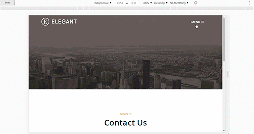
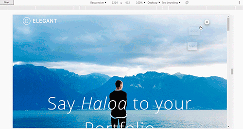
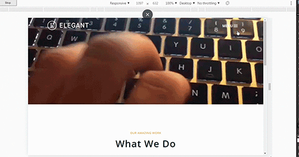

## Template Elegant
### Описание 

Шаблон выполнен на cms Wordpress. С применением Bootstrap 4, jquery 3.. Сделана адаптивная верстка согласно шаблону под Планшет и Мониторов. 

В директориии **model_database** лежит скриншоты дизайна и база данных. А также картинки залитые в вордпресс для шаблона.

###  Тесты    

Протестировано на следующих браузерах. Указаны версии где шаблон работает без ограничений.
##### Desktop 
|   IE  |   Edge    |   Firefox |   Chrome  |   Safari  | Opera |
|-------|-----------|-----------|-----------|-----------|-------|
|   11  |     -     |   45.0    |   46.0    |   -       |   20  |
|   -   |     -     |   66.0    |   74.0    |   -       |   20  |

##### Mobile 
|   IOS Safari | Opera Mobile | Android Browser | Chrome for Android | Firefox for android  | 
|--------------|--------------|-----------------|--------------------|----------------------|
|              |     53.3     |                 |         72.0       |          65.0        | 

###  Валидация    
Валидацию проходит.    
Есть некоторые замечания. Ошибок нет.

### Tест скорости    
[https://developers.google.com/speed/](https://developers.google.com/speed/)

|    Для компьютеров                             |     ***97%***|
|------------------------------------------------|--------------|           
|    Время загрузки первого контента             |      0,5 сек.|
|    Индекс скорости загрузки                    |      1,3 сек.|
|    Время загрузки для взаимодействия           |      1,6 сек.|
|    Время загрузки достаточной части контента   |      0,8 сек.|
|    Время окончания работы ЦП                   |      1,0 сек.|
|    Приблизительное время задержки при вводе    |         70 мс|

|       ***Для мобильных***                 |  ***78%*** |
|-------------------------------------------|------------| 
| Время загрузки первого контента           |   1,8 сек. |
| Индекс скорости загрузки                  |   3,6 сек. |
| Время загрузки для взаимодействия         |   6,1 сек. |
| Время загрузки достаточной части контента |   3,1 сек. |
| Время окончания работы ЦП                 |   5,2 сек. |
| Приблизительное время задержки при вводе  |   170 мс   |

###     Скриншоты шаблона

### Главная страница 

### Страница Work

### Страница Contact

